# FAQ Crowdsourcing Platform — System Architecture

---

## 1. High-Level Architecture Overview

The platform follows a **modular monolith** design for MVP (Phases 1–2), evolving into a **service-oriented architecture** for Phases 3–4. This allows rapid development early on while keeping clean boundaries for future extraction.

```
┌──────────────────────────────────────────────────────────────────────────────┐
│                              CLIENT LAYER                                    │
│                                                                              │
│  ┌──────────────┐  ┌──────────────┐  ┌──────────────┐  ┌────────────────┐   │
│  │  Web App      │  │  Mobile PWA  │  │  Embed Widget│  │  Admin Panel   │   │
│  │  (Next.js)    │  │  (PWA)       │  │  (JS SDK)    │  │  (Next.js)     │   │
│  └──────┬───────┘  └──────┬───────┘  └──────┬───────┘  └──────┬─────────┘   │
│         │                  │                  │                  │            │
└─────────┼──────────────────┼──────────────────┼──────────────────┼────────────┘
          │                  │                  │                  │
          ▼                  ▼                  ▼                  ▼
┌──────────────────────────────────────────────────────────────────────────────┐
│                          API GATEWAY / BFF LAYER                             │
│                                                                              │
│  ┌────────────────────────────────────────────────────────────────────────┐   │
│  │  API Gateway (Rate Limiting, Auth, CORS, Request Routing)             │   │
│  │  - REST API (public)   - WebSocket (real-time notifications)          │   │
│  │  - Webhook Dispatcher  - GraphQL (optional, Phase 3+)                 │   │
│  └────────────────────────────────────────────────────────────────────────┘   │
└──────────────────────────────────┬───────────────────────────────────────────┘
                                   │
          ┌────────────────────────┼────────────────────────┐
          ▼                        ▼                        ▼
┌──────────────────┐  ┌──────────────────────┐  ┌──────────────────────┐
│  CORE SERVICES   │  │  AI / INTELLIGENCE   │  │  PLATFORM SERVICES   │
│                  │  │                      │  │                      │
│ • Question Svc   │  │ • Semantic Search    │  │ • Auth & User Svc    │
│ • Answer Svc     │  │ • Duplicate Detect   │  │ • Notification Svc   │
│ • Voting Svc     │  │ • AI Summary Engine  │  │ • Moderation Svc     │
│ • Tag Svc        │  │ • Tiered Generation  │  │ • Analytics Svc      │
│ • Search Svc     │  │ • Self-Improvement   │  │ • Reputation Svc     │
│ • Dashboard Svc  │  │ • Key Term Extract   │  │ • Webhook Svc        │
│                  │  │ • Voice Transcribe   │  │ • Translation Svc    │
│                  │  │ • Quality Scoring    │  │ • Report Svc         │
└────────┬─────────┘  └──────────┬───────────┘  └──────────┬───────────┘
         │                       │                          │
         ▼                       ▼                          ▼
┌──────────────────────────────────────────────────────────────────────────────┐
│                            DATA LAYER                                        │
│                                                                              │
│  ┌──────────────┐  ┌──────────────┐  ┌──────────────┐  ┌────────────────┐   │
│  │  PostgreSQL   │  │ Elasticsearch│  │    Redis      │  │  Object Store  │   │
│  │  (Primary DB) │  │ (Search +    │  │  (Cache +     │  │  (S3/MinIO)    │   │
│  │              │  │  Vectors)    │  │   Sessions +  │  │  Images/Media  │   │
│  │              │  │              │  │   Queues)     │  │                │   │
│  └──────────────┘  └──────────────┘  └──────────────┘  └────────────────┘   │
└──────────────────────────────────────────────────────────────────────────────┘
```

---

## 2. Component Architecture — Detailed Breakdown

### 2.1 Client Layer

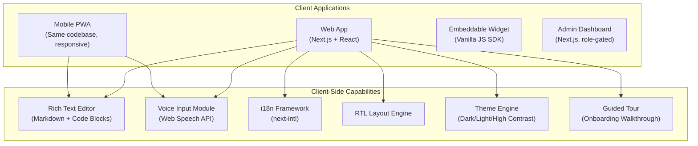

| Client | Tech | Maps to Product Feature |
|--------|------|------------------------|
| **Web App** | Next.js 14+ (App Router, SSR for SEO pages) | §4.5 SEO-optimized pages, §14.4 Mobile Responsiveness |
| **PWA** | Same Next.js codebase, service worker | §14.4 Progressive Web App |
| **Widget** | Standalone JS bundle (`<script>` tag embed) | §10.2 Embeddable Widget |
| **Admin Panel** | Next.js with role-gated routes | §12.3 Admin Dashboard |
| **Voice Input** | Web Speech API → review → submit | §4.2 Voice Input |
| **Rich Text Editor** | TipTap or MDXEditor (Markdown + code) | §4.2, §4.3 Rich text support |
| **i18n** | next-intl + ICU message format | §13 Multilingual Support |

---

### 2.2 API Gateway Layer

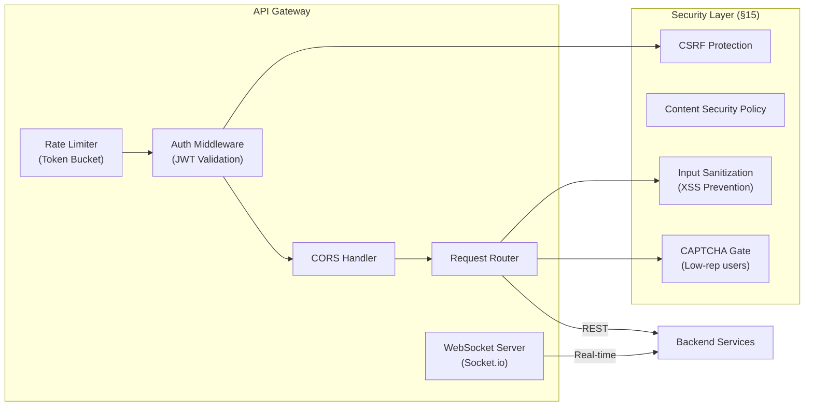

**Rate Limiting Rules (§5.3, §15):**

| Endpoint | Limit | Scope |
|----------|-------|-------|
| `POST /questions` | 5/hour | Per user (new users: 2/hour) |
| `POST /answers` | 10/hour | Per user |
| `POST /vote` | 30/hour | Per user |
| `GET /search` | 60/min | Per IP |
| `POST /auth/login` | 5/min | Per IP |

---

### 2.3 Core Services Layer

#### 2.3.1 Question Service

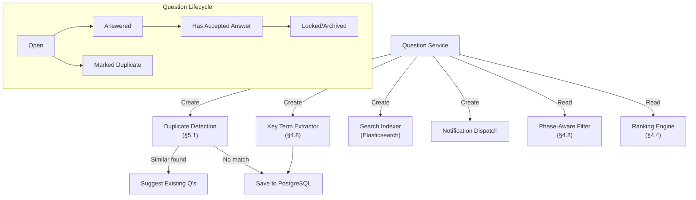

**Responsibilities:**
- CRUD operations on questions
- Trigger duplicate detection before saving (§5.1)
- Extract key terms on creation (§4.8)
- Index into Elasticsearch for full-text + semantic search
- Track question lifecycle state machine
- Emit events: `question.created`, `question.updated`, `question.closed`

---

#### 2.3.2 Answer Service

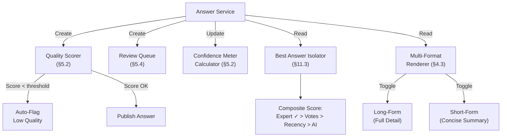

**Confidence Meter Calculation (§5.2):**
```
confidence_score = (
    (expert_upvotes × 3.0) +
    (contributor_upvotes × 1.0) -
    (expert_downvotes × 2.0) -
    (contributor_downvotes × 0.5) +
    (is_verified × 25) +
    (is_accepted × 20)
) / max_possible_score × 100
```

**Best Answer Composite Score (§11.3):**
```
best_score = (
    (is_expert_verified × 50) +
    (net_votes × 2) +
    (recency_decay × 5) +
    (ai_confidence × 10)
)
```

---

#### 2.3.3 Voting & Ranking Service

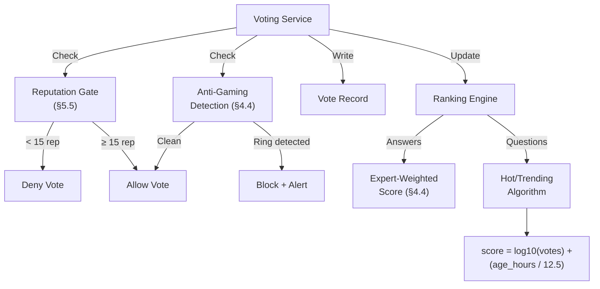

**Reputation Gating Thresholds (§5.5):**

| Action | Min Reputation |
|--------|---------------|
| Upvote | 15 |
| Comment | 50 |
| Downvote | 100 |
| Edit others' posts | 500 |
| Moderation tools | 1,000 |

---

#### 2.3.4 Personalized Dashboard Service

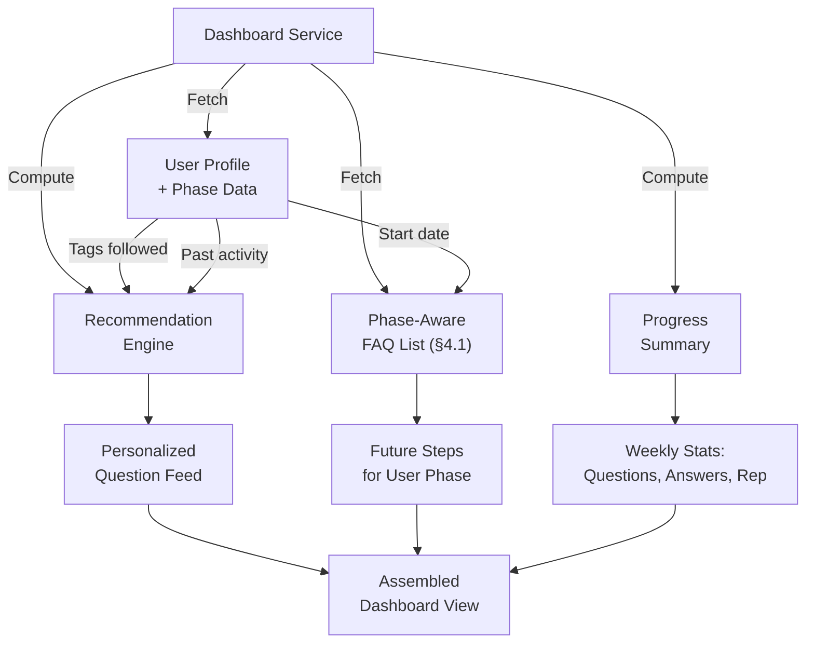

**Dashboard Composition (§4.1):**

| Panel | Data Source | Update Frequency |
|-------|-----------|-----------------|
| Phase-based FAQs & Future Steps | Question DB + Phase Config | On login |
| Recommended Questions | User tags + ML collaborative filter | Every 6 hours (cached) |
| Unanswered in Your Expertise | Tag-based query | Real-time |
| Progress Summary | Aggregated from activity log | On login |

---

### 2.4 AI & Intelligence Layer

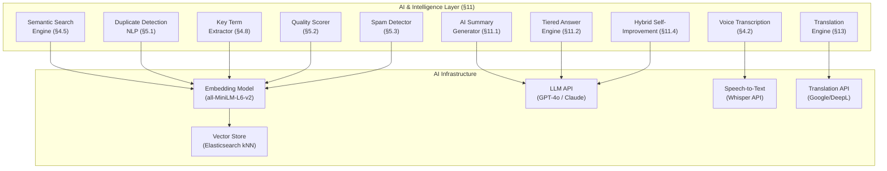

#### Tiered Answer Generation Flow (§11.2)

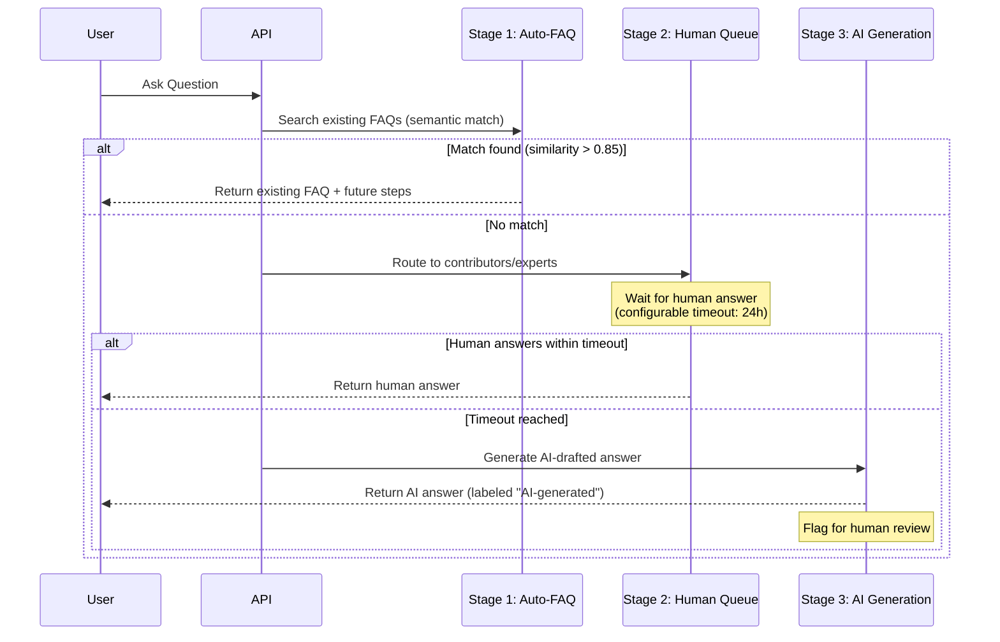

#### Hybrid Self-Improvement Loop (§11.4)

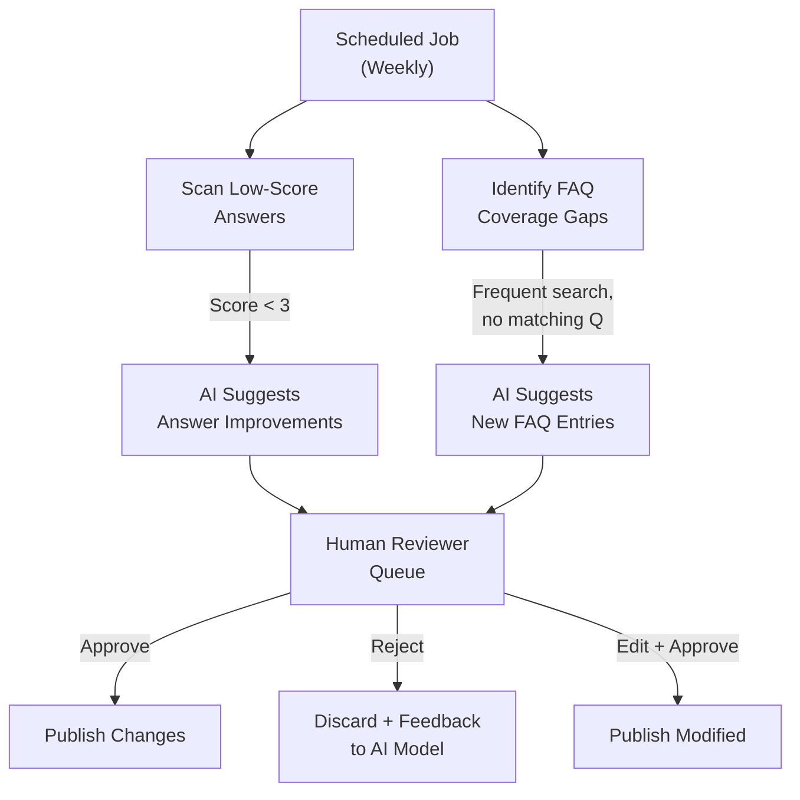

---

### 2.5 Platform Services Layer

#### 2.5.1 Auth & User Service

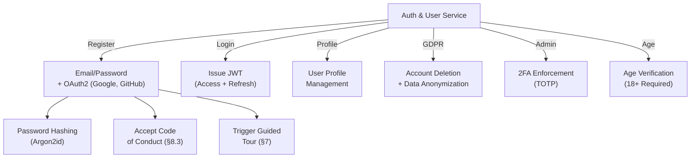

#### 2.5.2 Reputation & Gamification Service

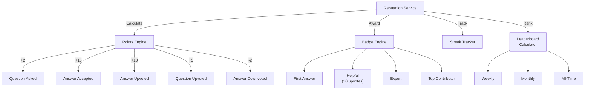

#### 2.5.3 Notification Service

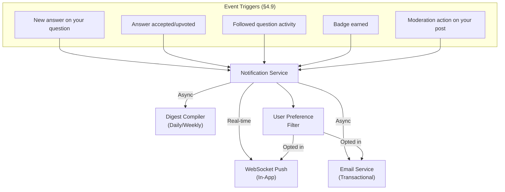

#### 2.5.4 Moderation Service

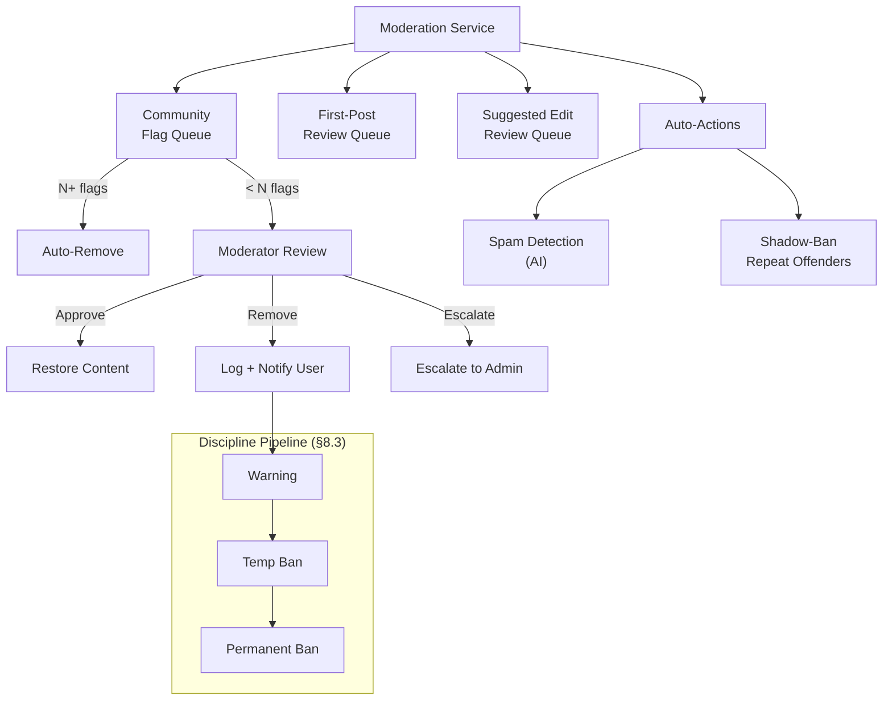

#### 2.5.5 Analytics & Reporting Service

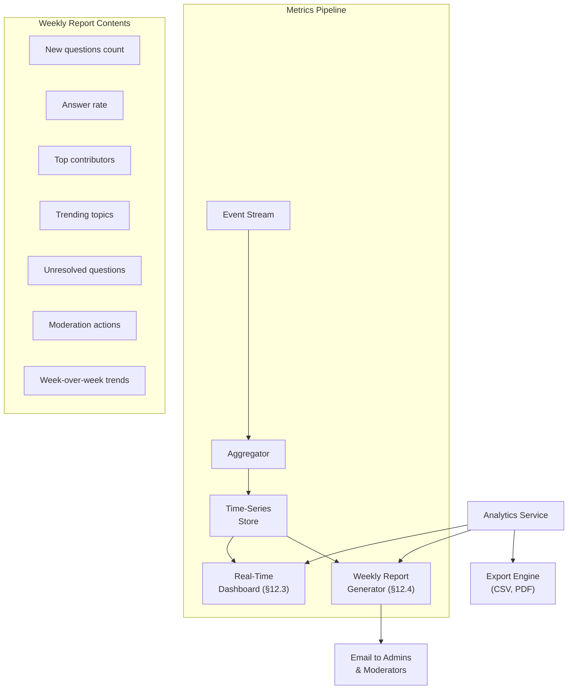

---

## 3. Data Layer — Database Schema

### 3.1 PostgreSQL (Primary Relational Store)

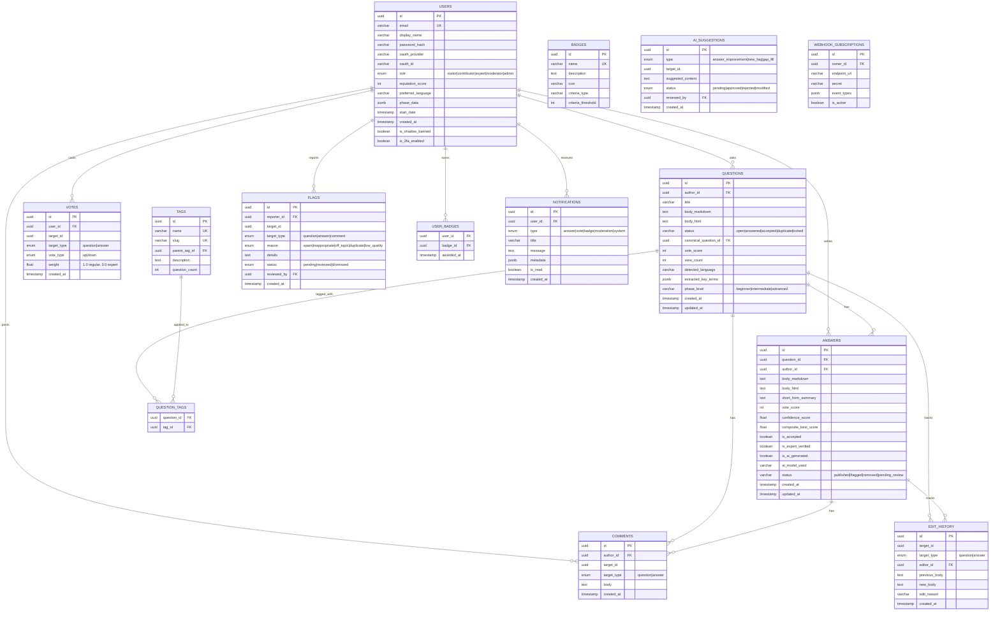

### 3.2 Elasticsearch (Search + Vector Store)

```
Index: faq_questions
├── title (text, analyzed)
├── body (text, analyzed)
├── tags (keyword[])
├── key_terms (keyword[])
├── phase_level (keyword)
├── language (keyword)
├── status (keyword)
├── vote_score (integer)
├── created_at (date)
├── embedding (dense_vector, dims: 384)  ← for semantic search
└── author_reputation (integer)

Index: faq_answers
├── body (text, analyzed)
├── question_id (keyword)
├── confidence_score (float)
├── is_expert_verified (boolean)
├── is_ai_generated (boolean)
├── language (keyword)
├── embedding (dense_vector, dims: 384)
└── created_at (date)
```

### 3.3 Redis (Cache + Sessions + Queues)

| Key Pattern | Purpose | TTL |
|-------------|---------|-----|
| `session:{token}` | User session data | 24h |
| `user:{id}:rep` | Cached reputation score | 5min |
| `question:{id}:votes` | Vote count cache | 1min |
| `rate:{user_id}:{action}` | Rate limiting counter | 1h |
| `dashboard:{user_id}` | Cached dashboard data | 6h |
| `trending:questions` | Trending questions list | 10min |
| `leaderboard:{period}` | Leaderboard cache | 30min |
| `search:suggestions:{prefix}` | Autocomplete cache | 1h |

**Redis Queues (Bull MQ):**

| Queue | Purpose | Priority |
|-------|---------|----------|
| `notifications` | Email + push notification dispatch | Normal |
| `indexing` | Elasticsearch indexing jobs | Normal |
| `ai-summary` | AI summary generation | Low |
| `ai-improvement` | Self-improvement scan jobs | Low |
| `reports` | Weekly report generation | Low |
| `webhooks` | Webhook event delivery | High |
| `moderation` | Auto-moderation checks | High |
| `translation` | Content translation jobs | Normal |

---

## 4. Key Data Flows

### 4.1 Question Submission Flow (with Voice + Dedup + Key Terms)

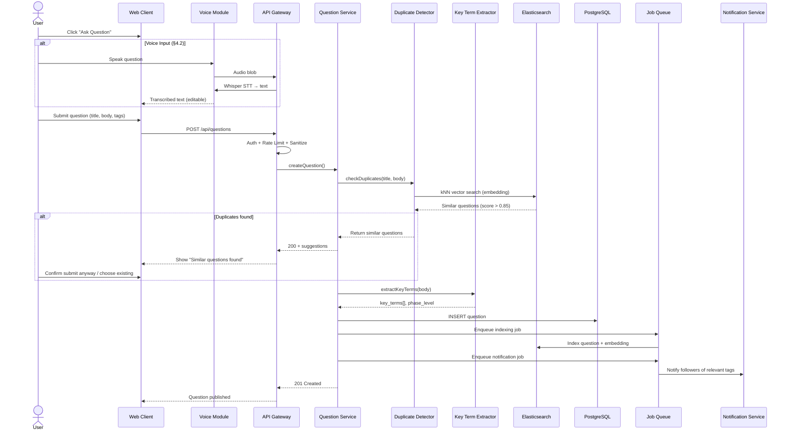

### 4.2 Search Flow (Full-Text + Semantic + Phase-Aware)

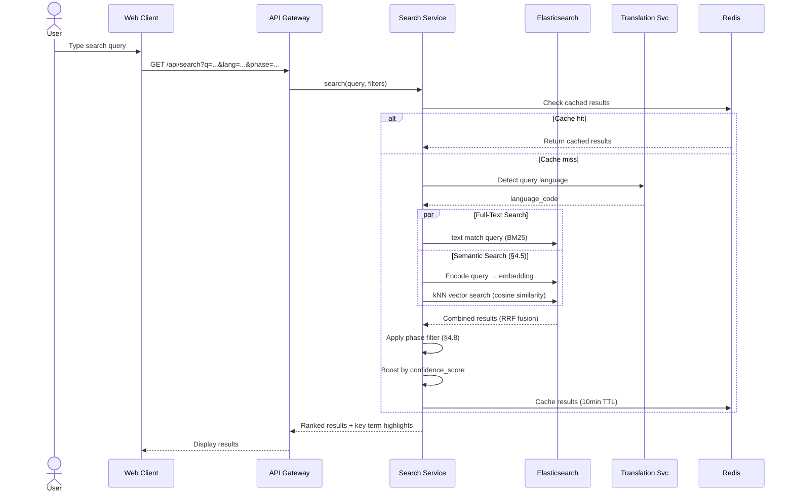

### 4.3 Answer Lifecycle Flow (Tiered + Quality + Confidence)

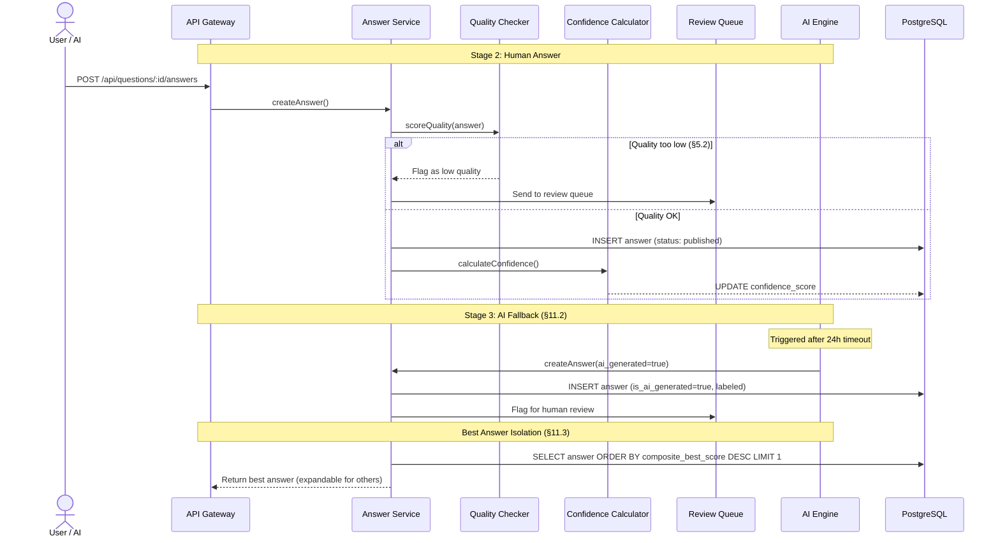

---

## 5. Technology Stack

### 5.1 Recommended Stack

| Layer | Technology | Rationale |
|-------|-----------|-----------|
| **Frontend** | Next.js 14+ (React, App Router) | SSR for SEO, API routes, PWA support |
| **UI Library** | Radix UI + custom CSS | Accessible, composable, WCAG 2.1 AA |
| **Rich Text** | TipTap (ProseMirror-based) | Markdown + code blocks + extensible |
| **State Mgmt** | TanStack Query + Zustand | Server state + client state |
| **i18n** | next-intl | ICU format, SSR-compatible, RTL support |
| **Backend** | Node.js (Express or Fastify) | Same language as frontend, async I/O |
| **ORM** | Prisma | Type-safe, migrations, PostgreSQL native |
| **Auth** | NextAuth.js + custom JWT | OAuth2 + credentials, session management |
| **Primary DB** | PostgreSQL 16+ | JSONB, full-text search, robust |
| **Search** | Elasticsearch 8+ (with kNN) | Full-text + vector search (semantic) |
| **Cache/Queue** | Redis 7+ + BullMQ | Caching, sessions, job queues |
| **Object Store** | AWS S3 / MinIO | Image uploads, media attachments |
| **AI Embeddings** | all-MiniLM-L6-v2 (self-hosted) | Sentence embeddings for semantic search |
| **LLM** | OpenAI GPT-4o / Anthropic Claude | Summaries, tiered answers, self-improvement |
| **Speech-to-Text** | OpenAI Whisper API | Voice input transcription |
| **Translation** | Google Cloud Translate / DeepL | Multilingual support |
| **Email** | Resend / AWS SES | Transactional + digest emails |
| **Real-time** | Socket.io | WebSocket notifications |
| **Monitoring** | Prometheus + Grafana | Metrics, alerts, dashboards |
| **Logging** | Pino + ELK Stack | Structured logging, searchable |
| **CI/CD** | GitHub Actions | Automated testing + deployment |
| **Hosting** | AWS (ECS/EKS) or Vercel + Railway | Scalable, managed infrastructure |

### 5.2 Stack Diagram

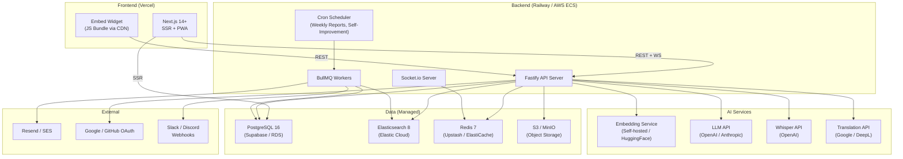

---

## 6. Deployment Architecture

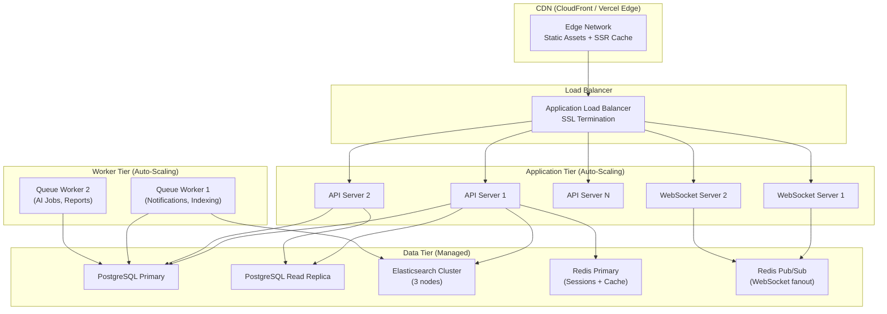

**Scaling Strategy:**

| Component | Scaling Method | Trigger |
|-----------|---------------|---------|
| API Servers | Horizontal (auto-scale) | CPU > 70% or p95 latency > 200ms |
| WebSocket Servers | Horizontal + Redis Pub/Sub | Connection count > 5,000/instance |
| Queue Workers | Horizontal | Queue depth > 1,000 |
| PostgreSQL | Read replicas | Read QPS > 10,000 |
| Elasticsearch | Add nodes | Index size > 50GB or latency > 500ms |
| Redis | Cluster mode | Memory > 80% |

---

## 7. Security Architecture (§15)

```mermaid
graph TD
    subgraph "Perimeter"
        WAF["Web Application Firewall"]
        DDOS["DDoS Protection<br/>(CloudFlare / AWS Shield)"]
        TLS["TLS 1.3 Everywhere"]
    end

    subgraph "Application Security"
        SANITIZE["Input Sanitization<br/>(DOMPurify)"]
        CSRF_TOK["CSRF Tokens<br/>(Double Submit Cookie)"]
        CSP_HDR["Content Security Policy<br/>Headers"]
        RATE["Rate Limiting<br/>(Token Bucket per user/IP)"]
        PARAM["Parameterized Queries<br/>(Prisma ORM)"]
    end

    subgraph "Auth Security"
        ARGON["Argon2id Password Hashing"]
        JWT_ROT["JWT Rotation<br/>(15min access, 7d refresh)"]
        TOTP["Admin 2FA<br/>(TOTP)"]
        OAUTH_SEC["OAuth2 PKCE Flow"]
    end

    subgraph "Data Security"
        ENCRYPT["AES-256 Encryption<br/>(Sensitive Fields)"]
        ANON["Data Anonymization<br/>(Account Deletion)"]
        AUDIT["Audit Log<br/>(All Admin Actions)"]
        BACKUP["Encrypted Backups<br/>(Daily)"]
    end

    subgraph "Monitoring"
        VULN["Dependency Scanning<br/>(Snyk / Dependabot)"]
        PENTEST["Annual Penetration Testing"]
        ALERT["Security Alert Pipeline"]
    end

    WAF --> SANITIZE --> PARAM
    TLS --> JWT_ROT --> TOTP
    ENCRYPT --> BACKUP
```

---

## 8. Feature-to-Architecture Mapping

| Product Feature (§) | Services Involved | Data Stores | AI Component |
|---------------------|------------------|-------------|-------------|
| 4.1 Personalized Dashboard | Dashboard Svc, Reputation Svc | PostgreSQL, Redis (cache) | Collaborative filter |
| 4.2 Question + Voice Input | Question Svc | PostgreSQL, Elasticsearch | Whisper STT |
| 4.3 Multi-Format Answers | Answer Svc | PostgreSQL | LLM (short-form generation) |
| 4.4 Expert-Weighted Voting | Voting Svc, Reputation Svc | PostgreSQL, Redis | — |
| 4.5 Semantic Search | Search Svc | Elasticsearch (kNN) | Embedding model |
| 4.6 Tags & Categories | Tag Svc | PostgreSQL | — |
| 4.7 Reputation & Badges | Reputation Svc | PostgreSQL, Redis | — |
| 4.8 Key Term & Phase ID | Question Svc | PostgreSQL, Elasticsearch | Embedding + NER |
| 4.9 Notifications | Notification Svc | PostgreSQL, Redis (Pub/Sub) | — |
| 5.1 Duplicate Detection | Question Svc | Elasticsearch (kNN) | Embedding model |
| 5.2 Confidence Meter | Answer Svc, Voting Svc | PostgreSQL | Scoring algorithm |
| 5.3 Spam Prevention | Moderation Svc | PostgreSQL, Redis | Spam classifier |
| 5.4 Quality Check Process | Moderation Svc | PostgreSQL | Quality scorer |
| 5.5 Trust Gating | Auth Svc, Reputation Svc | PostgreSQL, Redis | — |
| 10.1 REST API | API Gateway | All | — |
| 10.2 Widget | Widget SDK (CDN) | — | — |
| 10.3 Webhooks | Webhook Svc | PostgreSQL, Redis (queue) | — |
| 11.1 AI Summaries | AI Engine | PostgreSQL | LLM |
| 11.2 Tiered Answers | AI Engine, Answer Svc | PostgreSQL, Elasticsearch | LLM |
| 11.3 Best Answer | Answer Svc | PostgreSQL | Scoring algorithm |
| 11.4 Self-Improvement | AI Engine, Cron | PostgreSQL, Elasticsearch | LLM |
| 12.3 Admin Dashboard | Analytics Svc | PostgreSQL (aggregated) | — |
| 12.4 Weekly Reports | Report Svc, Cron | PostgreSQL | — |
| 13 Multilingual | Translation Svc, i18n | PostgreSQL | Translation API |

---

## 9. Performance Targets vs Architecture

| Requirement (§14) | Target | Architecture Solution |
|-------------------|--------|----------------------|
| Page load | < 2s | Next.js SSR + CDN + Redis page cache |
| Search results | < 500ms | Elasticsearch with warm cache + Redis |
| API response (p95) | < 200ms | Fastify + connection pooling + read replicas |
| 10,000+ concurrent | Supported | Horizontal auto-scaling + WebSocket fanout via Redis Pub/Sub |
| WCAG 2.1 AA | Compliant | Radix UI primitives + semantic HTML + ARIA |

---

## 10. Environment Setup

```
├── apps/
│   ├── web/                    # Next.js frontend (user-facing + admin)
│   └── widget/                 # Embeddable widget JS SDK
├── packages/
│   ├── api/                    # Fastify backend API
│   ├── db/                     # Prisma schema + migrations
│   ├── ai/                     # AI service (embeddings, LLM, STT)
│   ├── queue/                  # BullMQ job definitions + workers
│   ├── shared/                 # Shared types, utils, constants
│   └── config/                 # Environment configs
├── docker-compose.yml          # Local dev (PG + ES + Redis + MinIO)
├── .github/workflows/          # CI/CD pipelines
├── turbo.json                  # Turborepo config
└── package.json                # Monorepo root
```
